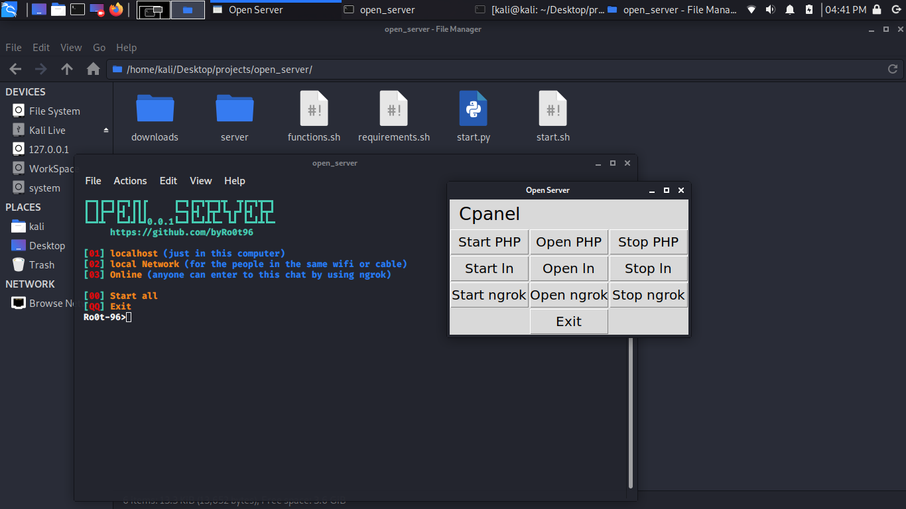

# Open Server
'open_server' for run a PHP server and shar it in local network OR online (using ngrok).


<div align="center">
    <!--a href="" target="_blank"-->
        
    <!--/a-->
</div>
<!---->


### Languages :
* python
* bash

### System :
* Linux

# Requirements
in bash
[✓] php
[✓] curl
[✓] unzip
[✓] wget

in python
[✓] tkinter
[✓] os
[✓] subprocess


# How to get this tool
```
git clone https://github.com/byRo0t96/open_server.git
cd open_server
```

# How to run after download
```
pip install -r requirements.txt
python start.py
```
OR
```
pip install -r requirements.txt
bash start.sh
```


# SUPPORTED DISTRIBUTIONS
|Distribution | Version Check | supported | status |
----------|-------|------|-------|
|Kali Linux|2020.1 | yes | working   |


## Release History
```
[◉] Version 0.0.1 [05-04-2020]
...
```


### Contact :
##### Mail : by.root96@gmail.com

## License
Copyright (C) 2010 - 2020 [byRo0t96](https://byro0t96.github.io/)

